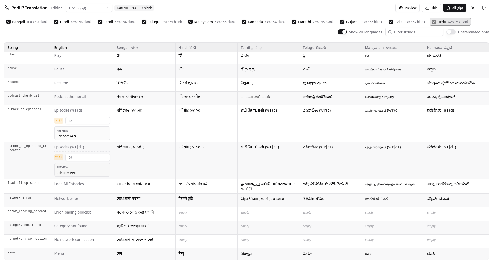

# PodLP Translation Tool

I needed translations for an Android app. The translators couldn't deliver XML,
and it was too much work converting the different kinds of text (including RTL)
into XML by hand. On top of that, they kept getting tripped up by things like
HTML syntax and placeholders such as `%1$d`. So I just built a simple
translation app.

It's a small password-gated web app that lets translators (who don't touch code)
translate the PodLP Android `strings.xml` into Indian languages, and generates
valid Android `strings.xml` files from their submissions.



## Target languages

Hindi, Tamil, Telugu, Malayalam, Kannada, Marathi, Gujarati, Odia, Urdu.
(Edit `convex/lib/languages.ts` to add/remove.)

## Features

- **Single shared password** - best auth solution for this one-time
  project with many non-techie translators, less hassle since no per-user
  accounts to manage.
- **Preview for strings with args** - strings with placeholders replaced
  by a sample changeable value, and warns if a placeholder goes missing.
- **Rich-text editing** converted to HTML under the hood and wrapped in CDATA
  as needed.
- **Convex live updates and stats** — track translation progress live.
- **Generate all required XML files easily** — one language or all of them at
  once.

## Stack

- **Backend**: [Convex](https://convex.dev) (`convex/`) — shared-password auth
  (`convex/auth.ts`), database persistence (`convex/schema.ts`,
  `convex/translations.ts`), and XML/ZIP generation via HTTP Actions
  (`convex/http.ts`).
- **Frontend**: React + TypeScript + Vite + Tailwind + **shadcn/ui** at the repo
  root (`src/`, `index.html`). Talks to Convex directly via the browser client
  in `src/lib/api.ts`.

The source schema (parsed from `strings.xml`) and the initial Bangla
translations are seeded into Convex. Regenerate the static seed data with
`node scripts/gen-schema-data.mjs` (reads `strings.xml` + `data/translations.json`).

## Setup

```sh
pnpm install

# One-time: create a Convex project + generate convex/_generated.
# This opens a browser to log in and writes VITE_CONVEX_URL to .env.local.
npx convex dev            # leave running, or Ctrl-C after it prints "ready"

# Set the shared-password env vars on the deployment:
npx convex env set TRANSLATOR_PASSWORD "your-shared-password"
npx convex env set SESSION_SECRET "$(openssl rand -hex 32)"

# Seed the source schema + existing Bangla translations:
pnpm seed                 # -> npx convex run seed:run
```

## Run locally

Run both the Convex backend and Vite dev server together:

```sh
pnpm dev:all              # Convex + UI on http://localhost:5173
```

Or run them in separate terminals if you prefer:

```sh
pnpm dev:convex           # terminal 1 — Convex backend (also keeps codegen fresh)
pnpm dev                  # terminal 2 — UI on http://localhost:5173
```

Open http://localhost:5173.

## Build & deploy

The app deploys to Netlify (see `netlify.toml`), which runs `convex deploy`
and builds the SPA in one step:

```sh
npx convex deploy --cmd 'pnpm run build'   # push functions + build dist/
```

To build locally without deploying:

```sh
pnpm build                # -> dist/ (static SPA)
```

The production build must be given the production `VITE_CONVEX_URL` at build
time. Any static host works (Netlify, Vercel, …).

## Environment variables

Client (build time, `.env.local`):

| Var               | Meaning                                    |
| ----------------- | ------------------------------------------ |
| `VITE_CONVEX_URL` | Convex deployment URL (set by `convex dev`) |

Backend (set with `npx convex env set …`):

| Var                   | Meaning                          | Default            |
| --------------------- | -------------------------------- | ------------------ |
| `TRANSLATOR_PASSWORD` | Shared password for translators  | `podlp` (dev only) |
| `SESSION_SECRET`      | HMAC secret for the auth token   | insecure dev value |

## Auth model

There are **no per-user accounts** — a single shared password gates access
(matching the original tool). A correct password returns a stateless
HMAC-signed token that the browser stores in `localStorage` and passes to every
protected query/mutation/HTTP Action, where it is re-validated. To rotate
access, change `TRANSLATOR_PASSWORD` (and optionally `SESSION_SECRET` to
invalidate all existing tokens).

## How output is generated

The source `strings.xml` defines the structure and order. For each language the
app emits every `<string>` / `<string-array>`:

- translatable entries use the submitted translation (falling back to English
  if not yet translated);
- non-translatable and untranslated entries fall back to the English source, so
  the generated file is always complete and valid;
- entries whose source used CDATA are re-wrapped in CDATA; plain strings are
  entity-escaped and apostrophes/quotes are `\`-escaped per Android rules.

Note: the source has both a `<string name="changelog">` and a
`<string-array name="changelog">`. Storage keys are namespaced (`s:` for
strings, `a:` for arrays) so they never collide.

Downloads are served by Convex HTTP Actions (`*.convex.site/download/<lang>`,
`/download-all`, `/preview/<lang>`), authorized via a `?token=` query param.
Drop the ZIP contents into `app/src/main/res/` and the `values-<code>/` folders
line up with Android's locale qualifiers.
