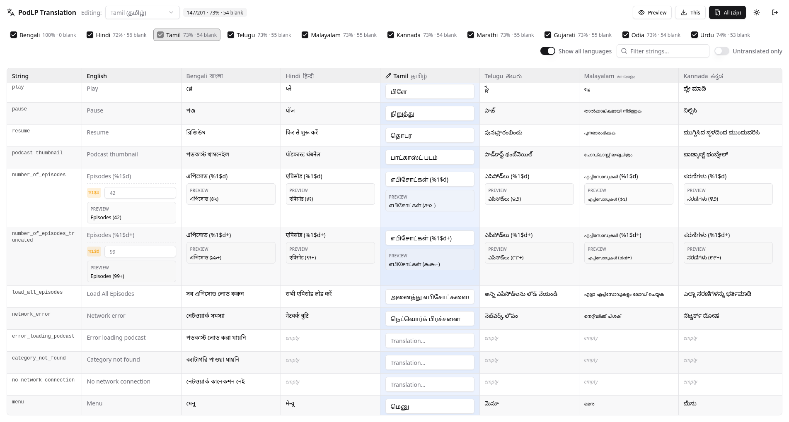
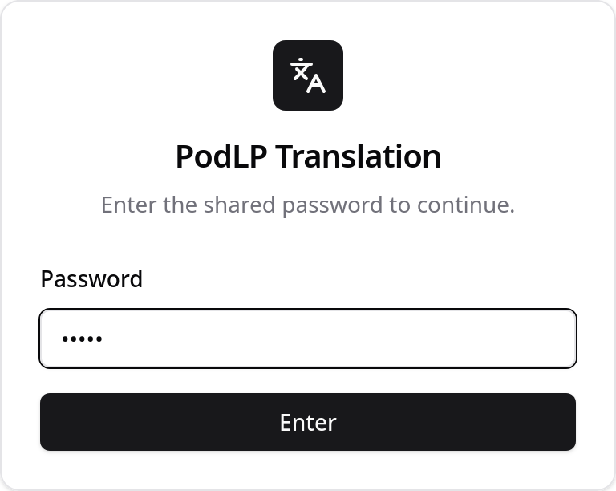
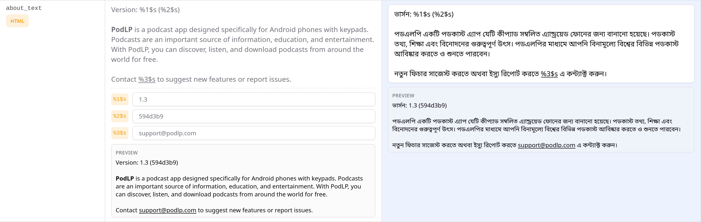
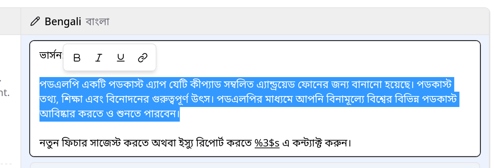
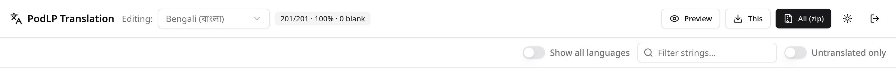
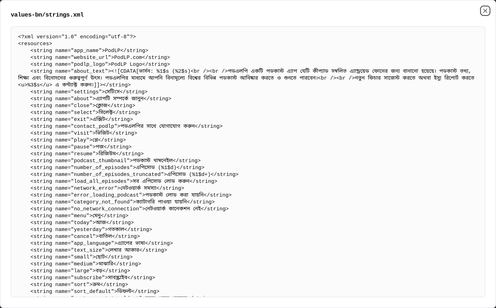

# PodLP Translation Tool

I needed translations for an Android app. The translators couldn't deliver XML,
and it was too much work converting the different kinds of text (including RTL)
into XML by hand. On top of that, they kept getting tripped up by things like
HTML syntax and placeholders such as `%1$d`. So I just built a simple
translation app.

It's a small password-gated web app that lets translators (who don't touch code)
translate the PodLP Android `strings.xml` into Indian languages, and generates
valid Android `strings.xml` files from their submissions.



## Target languages

Hindi, Tamil, Telugu, Malayalam, Kannada, Marathi, Gujarati, Odia, Urdu.
(Edit `convex/lib/languages.ts` to add/remove.)

## Features

- **Single shared password** - best auth solution for this one-time
  project with many non-techie translators, less hassle since no per-user
  accounts to manage.

  

- **Preview for strings with args** - strings with placeholders replaced
  by a sample changeable value, and warns if a placeholder goes missing.

  

- **Rich-text editing** converted to HTML under the hood and wrapped in CDATA
  as needed.

  

- **Convex live updates and stats** — track translation progress live.

  

- **Generate all required XML files easily** — one language or all of them at
  once.

  

## Setup & run

```sh
pnpm install

# One-time: create a Convex project + set env vars + seed data.
npx convex dev            # log in, writes VITE_CONVEX_URL to .env.local
npx convex env set TRANSLATOR_PASSWORD "your-shared-password"
npx convex env set SESSION_SECRET "$(openssl rand -hex 32)"
pnpm seed

# Run locally (Convex + UI on http://localhost:5173):
pnpm dev:all

# Build / deploy:
pnpm build                                 # -> dist/ (static SPA)
npx convex deploy --cmd 'pnpm run build'   # push functions + build dist/
```

## Environment variables

Client (build time, `.env.local`):

| Var               | Meaning                                    |
| ----------------- | ------------------------------------------ |
| `VITE_CONVEX_URL` | Convex deployment URL (set by `convex dev`) |

Backend (set with `npx convex env set …`):

| Var                   | Meaning                          | Default            |
| --------------------- | -------------------------------- | ------------------ |
| `TRANSLATOR_PASSWORD` | Shared password for translators  | `podlp` (dev only) |
| `SESSION_SECRET`      | HMAC secret for the auth token   | insecure dev value |
